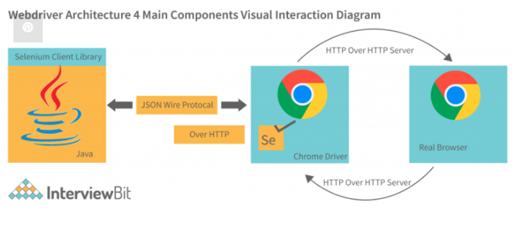

**#1.	Explain Selenium architecture.**

**Ans.**

Selenium webdriver has the following units −

**Selenium Binding Languages/Selenium Client library** − Selenium can work on various libraries like Java, Python, Ruby, and so on. It has the language bindings for more than one language.

**JSON Wire Protocol over HTTP** − JSON is Javascript Object Notion. It is used for transferring data from the server to the client on the web page. It is based on the Rest API that transmits information among HTTP servers.

**Browser Driver** − All the browsers have a specific browser driver. They interact with the browsers (hiding the logic of browser functionality). As the browser driver receives a command, it is run on the browser and the status of the execution goes back in form of HTTP response.

**Browser** − Selenium can test applications on browsers like Firefox, Chrome, IE, and so on.

Reference: https://www.interviewbit.com/blog/selenium-architecture/

